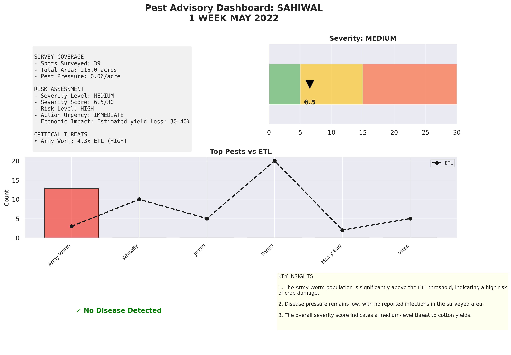
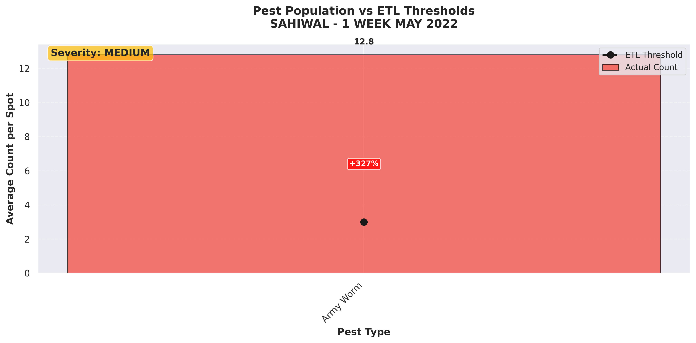

# Pest Advisory System

Turn raw cotton pest survey data into decision-ready advisories. This repository bundles a full analytics pipeline: data cleaning, LLM-powered analysis, chart generation, PDF report authoring, and a Streamlit dashboard for interactive review.

---

## Table of Contents
- [Overview](#overview)
- [Architecture at a Glance](#architecture-at-a-glance)
- [Project Structure](#project-structure)
- [Getting Started](#getting-started)
- [Preparing Data](#preparing-data)
- [Running Analyses](#running-analyses)
  - [Single-row quick run](#single-row-quick-run)
  - [Full-batch processing](#full-batch-processing)
  - [Unit-style batch test](#unit-style-batch-test)
- [Inspecting Results](#inspecting-results)
  - [Generated artefacts](#generated-artefacts)
  - [Streamlit dashboard](#streamlit-dashboard)
- [Sample Output Gallery](#sample-output-gallery)
- [Configuration & Customisation](#configuration--customisation)
- [Troubleshooting](#troubleshooting)
- [License](#license)

---

## Overview

Agriculture departments monitor cotton pests weekly across Punjab’s tehsils. This toolkit automates the heavy lifting:

- **Clean** raw CSV exports and engineer survey metrics.
- **Score** severity, identify ETL violations, and gather insights via an Ollama-hosted LLaMA encoder.
- **Visualise** pest trends, severity gauges, and disease incidence through publication-ready charts.
- **Report** the findings in polished PDF briefings with farmer-focused recommendations.
- **Review** outputs from a Streamlit dashboard that links every chart and report for rapid triage.

---

## Architecture at a Glance

```
Raw CSV ──▶ DataCleaning ──▶ PestDataEncoder ──▶ LLM analysis
                                  │              │
                                  │              └── farmer advice (English)
                                  │
                                  ├──▶ PestVisualizer ──▶ PNG charts
                                  │
                                  ├──▶ PestReportGenerator ──▶ PDF report
                                  │
                                  └──▶ JSON output (context + analysis + artefact paths)

All outputs land under outputs/ and can be explored via Streamlit dashboard.py
```

---

## Project Structure

| Path | Description |
| --- | --- |
| `src/datapreprocessing/` | Cleans survey data and builds derived metrics (`DataCleaning`). |
| `src/encoder/` | Orchestrates severity scoring, LLM prompts, chart/report generation. |
| `src/visualization/` | Matplotlib/Seaborn visual components (`PestVisualizer`). |
| `src/reporting/` | PDF assembly via Matplotlib (`PestReportGenerator`). |
| `dashboard.py` | Streamlit dashboard to browse analyses, charts, and reports. |
| `outputs/` | Persisted JSON, PNG charts, and PDF reports from sample/batch runs. |
| `run_full_batch.py` | Convenience script to run the encoder across an entire cleaned dataset. |
| `tests/` | Utilities for smoke-testing the encoder with representative samples. |

---

## Getting Started

**Prerequisites**
- Python 3.9+
- [Ollama](https://ollama.com/) running locally (`ollama serve`).
- Model specified in `src/config/config.py` (default `llama3:8b`) pulled locally: `ollama pull llama3:8b`.

**Setup**

```bash
python -m venv .venv
source .venv/bin/activate      # Windows: .venv\Scripts\activate
pip install --upgrade pip
pip install -r requirements.txt
```

---

## Preparing Data

Clean the raw Punjab survey export before analysis:

```python
from src.datapreprocessing.dataprocessing import DataCleaning

cleaner = DataCleaning()
clean_df = cleaner.clean_cotton_pest_data("data/raw_pest_survey.csv")
clean_df.to_csv("data/pest_survey_cleaned.csv", index=False)
```

The cleaner normalises headers, fixes invalid rows, fills missing pest counts, and creates helper columns like `TOTAL_PESTS_ABOVE_ETL` and `PEST_PRESSURE_PER_ACRE`.

---

## Running Analyses

### Single-row quick run

`src/encoder/encoder.py` exposes `PestDataEncoder`. Run directly to analyse an example payload:

```bash
python src/encoder/encoder.py
```

The script prints results to stdout and saves JSON/charts/PDF artefacts when Ollama replies successfully.

### Full-batch processing

Use the helper script to iterate over every row of the cleaned dataset:

```bash
python run_full_batch.py
```

The script expects `data/pest_survey_cleaned.csv` (adjust `CLEAN_CSV` if your path differs). Each row triggers `encoder.analyze(...)`, producing:

- `outputs/encoder_results/<tehsil>_<timeframe>_<timestamp>.json`
- `outputs/charts/…png`
- `outputs/reports/pest_report_<tehsil>_<timestamp>.pdf`

### Unit-style batch test

`tests/test_encoder.py` performs a stratified sample (low/medium/high severity). Update the CSV path inside the script, then run:

```bash
python tests/test_encoder.py
```

The test logs summaries, stores individual results, and generates a batch summary JSON for post-run auditing.

---

## Inspecting Results

### Generated artefacts

Outputs are grouped by type under `outputs/`:

| Directory | Contents |
| --- | --- |
| `outputs/encoder_results/` | JSON per tehsil/timeframe combining survey context, encoder analysis, farmer advice, and references to charts/reports. |
| `outputs/charts/` | PNG images for pest comparisons, severity gauges, disease bars, critical threats, and dashboard layouts. |
| `outputs/reports/` | Multi-page PDF advisories that blend metrics, insights, farmer guidance, and embedded charts. |

### Streamlit dashboard

Launch the reviewer UI to browse outputs without leaving the browser:

```bash
streamlit run dashboard.py
```

Dashboard capabilities:
- Select any encoder run (batch summaries are auto-filtered).
- View severity metrics, urgency, and economic impact at a glance.
- Inspect tabular pests vs ETL and disease infection rates.
- Read LLM-generated insights plus farmer advisory bullet points.
- See every matching chart discovered on disk—even if the original JSON lacks explicit paths.
- Download the most recent PDF report aligned to the selected tehsil.

---

## Sample Output Gallery

- Dashboard overview chart

  

- Pest vs ETL comparison

  

- Generated PDF report (downloadable example)

  [`outputs/reports/pest_report_sahiwal_20251030_044423.pdf`](outputs/reports/pest_report_sahiwal_20251030_044423.pdf)

---

## Configuration & Customisation

- **Models & thresholds:** Tweak ETL values, severity breakpoints, and Ollama model settings in `src/config/config.py`.
- **Prompt engineering:** Adjust the encoder prompt or post-processing logic inside `src/encoder/encoder.py`.
- **Visual style:** Modify colour palettes, figure sizes, and chart layouts in `src/config/config.py` and `src/visualization/visualizer.py`.
- **Reports:** Extend `PestReportGenerator` to add chapters, tables, or localisation.
- **Dashboard:** Enhance `dashboard.py` (or build extra Streamlit pages under `frontend/`) for trend comparisons or cross-tehsil analytics.

---

## Troubleshooting

| Symptom | Possible fix |
| --- | --- |
| **Dashboard shows no runs** | Confirm `outputs/encoder_results/` contains JSON files (excluding `batch_summary_*`). Run the encoder if empty. |
| **Charts/PDF missing** | The dashboard now scans disk for the latest artefacts per tehsil, but if none exist rerun the encoder with `auto_visualize/auto_report` enabled. |
| **LLM connection errors** | Ensure `ollama serve` is running and the configured model is downloaded. Update `OLLAMA_BASE_URL` if running remotely. |
| **Unicode or font issues in plots** | Install fonts required by Matplotlib/Seaborn or adjust font settings in `src/config/config.py`. |
| **Large batch takes too long** | Run `run_full_batch.py` overnight or segment by district. The script prints progress per tehsil. |

---

## License

Project contents are provided as-is. Adapt and extend the pipeline to suit your agricultural advisory workflows.

